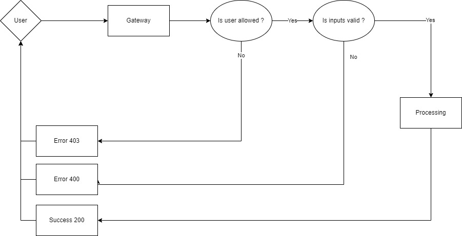
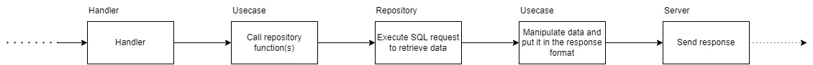

# Technical test EDF Forecast

## Introduction

I am using the DDD approach with the clean architecture for my projects.

## Documentation

Endpoint: "/doc".

## Testing

For the complex functions, I use unit tests, and to test all the endpoints I use integration tests.

## Deploiment

I use docker-compose to deploy the application.

## Production 

AWS or GCP with a Kubernetes cluster.